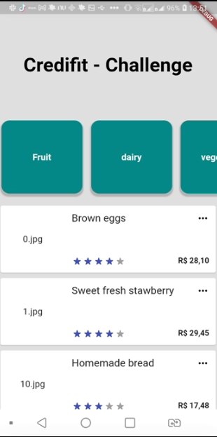

<h1>Resolucao do desafio técnico para o processo seletivo da empresa Credifit by (Coodesh).</h1>


<h2>Como rodar o projeto</h2>

  + [ Build_Flutter ]

    ```
    $ git clone projeto
    $ cd nome-projeto
    $ flutter build run
    ```
    
<h2>Detalhe do desafio</h2>

* Utilizar o seu github pessoal para publicar o desafio. Confirme que a visibilidade do projeto é pública (não esqueça de colocar no readme a referência a este challenge); 
* Leia atentamente todo o descritivo desse documento antes de qualquer coisa; 
* O projeto deverá ser desenvolvido em Flutter/Dart; 
* Os produtos disponíveis no projeto da aplicação devem ser recuperados através do Firebase Realtime DB ou Firestore; 
* Utilize sempre boas práticas nas implementações. OOP, SOLID, DDD, Clean Code, Injeção de Dependência são sempre bem-vindos e fazem toda diferença!!!

###  Base de Dados

 
* Utilizar o Firestore ou Firebase Realtime DB

## Suporte

Use a [nossa comunidade](https://coodesh.com/desenvolvedores#community) para tirar dúvidas sobre o processo ou envie um e-mail para contato@coodesh.com.

### Screenshots 

 


<h2>Detalhes de Configuracao</h2>
  
  + Flutter channel: stable 
  + Flutter: versao 3.0.2
  + Dart: versao 2.17.3
  + Design Pattern: MVVM
  + Dependencias Utilizadas:  
    - cloud_firestore
    - flutter_rating_bar
    - intl: 
    - grouped_list:
    - flutter_svg:
    - hexcolor:
    - flutter_mobx:
    - mask: 
    - app_popup_menu: 

<h2>Como rodar o projeto</h2>

  + [Build_Mobile]

    ```
    $ clone o projeto
    $ cd nome-projeto
    $ flutter build run

    ```

## Candidato/Desenvolvedor

Seguem meu perfil do Linkedin, [@devtvas](https://www.linkedin.com/in/devtvas/).
