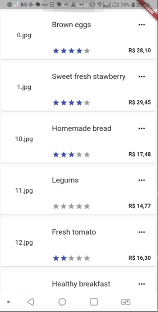
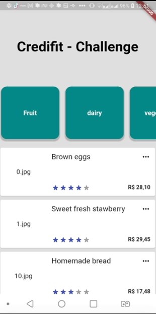
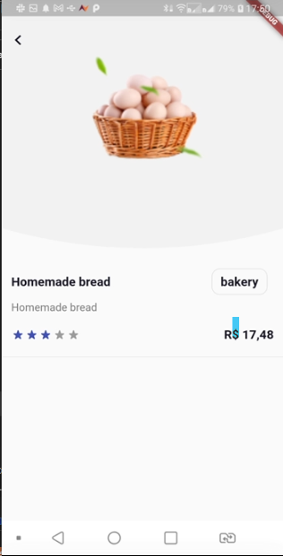
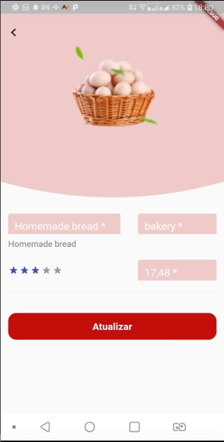
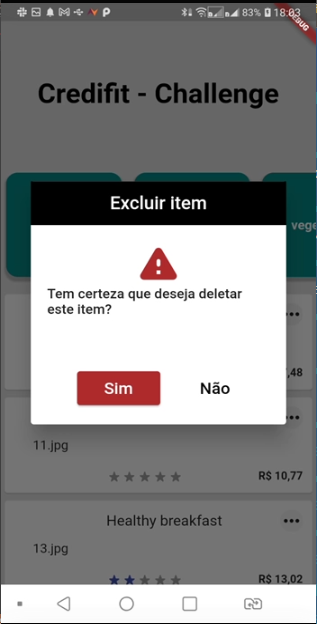

<h1>CRED-04</h2>

## Historia do projeto (branchs)

- [MAIN](https://github.com/devtvas/flutter_challenge_credifit/tree/main) - 11/06/22
- [CRED-02](https://github.com/devtvas/flutter_challenge_credifit/tree/CRED-02) - 12/06/22 
- [CRED-03](https://github.com/devtvas/flutter_challenge_credifit/tree/CRED-03) - 13/06/22 
- [CRED-04](https://github.com/devtvas/flutter_challenge_credifit/tree/CRED-04) - 15/06/22 - (voce esta aqui!)

<h2>Atividades realizadas</h2>

* ViewModels

### Screenshots v1

 

### Screenshots v2

## Suporte

Use a [nossa comunidade](https://coodesh.com/desenvolvedores#community) para tirar dúvidas sobre o processo ou envie um e-mail para contato@coodesh.com.
## Candidato/Desenvolvedor

Seguem meu perfil do Linkedin, [@devtvas](https://www.linkedin.com/in/devtvas/).
