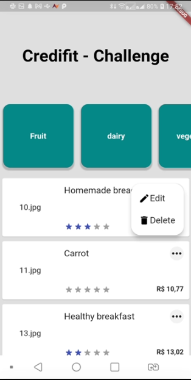

<h1>CRED-03</h2>

  + [Build_Mobile]
    
    ```
    $ clone o projeto
    $ cd nome-projeto
    $ flutter build run

    ```
<h2>Atividades CRED03</h2>

* Refatoracao;
* Aplicado principio SOLID (SRP)

###  Base de Dados
 
* Utilizar o Firestore ou Firebase Realtime DB

## Suporte

Use a [nossa comunidade](https://coodesh.com/desenvolvedores#community) para tirar dúvidas sobre o processo ou envie um e-mail para contato@coodesh.com.

### Screenshots v1

 

### Screenshots v2





<h2>Detalhes de Configuracao</h2>
  
  + Flutter channel: stable 
  + Flutter: versao 3.0.2
  + Dart: versao 2.17.3
  + Design Pattern: MVVM
  + Dependencias Utilizadas:  
    - cloud_firestore
    - flutter_rating_bar
    - intl: 
    - grouped_list:
    - flutter_svg:
    - hexcolor:
    - flutter_mobx:
    - mask: 
    - app_popup_menu: 


## Candidato/Desenvolvedor

Seguem meu perfil do Linkedin, [@devtvas](https://www.linkedin.com/in/devtvas/).
